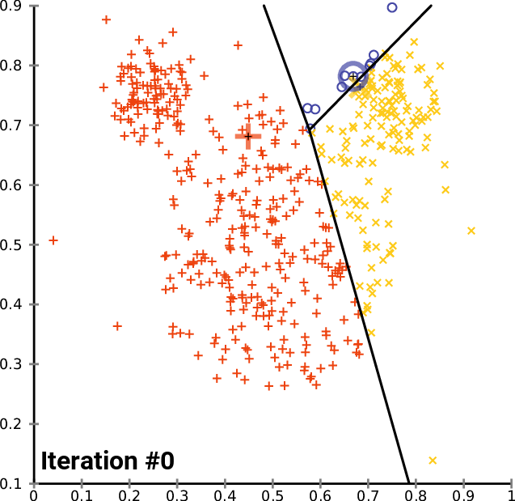

<!-- Google tag (gtag.js) -->
<script async src="https://www.googletagmanager.com/gtag/js?id=G-JDGJ43EW20"></script>
<script>
  window.dataLayer = window.dataLayer || [];
  function gtag(){dataLayer.push(arguments);}
  gtag('js', new Date());

  gtag('config', 'G-JDGJ43EW20');
</script>

<!-- _paginate: false -->


---

# [https://denny.one/bwai-2025](https://denny.one/bwai-2025)

---

# Denny Huang

- GDG Cloud Taipei Organizer
- <a href="https://sitcon.org/" target="_blank">SITCON 學生計算機年會</a> 共同發起人
- 雷亞遊戲 Rayark Inc.
- <a href="https://denny.one/" target="_blank">About me</a>

---

# <a href="https://cloud.google.com/bigquery" target="_blank">BigQuery</a>

---

# <a href="https://cloud.google.com/bigquery/public-data" target="_blank">BigQuery Public Datasets</a>
## <a href="https://console.cloud.google.com/bigquery?p=bigquery-public-data&d=faa&t=us_airports&page=table" target="_blank">FAA US Airports</a>

---

# <a href="https://cloud.google.com/gemini/docs/bigquery/overview" target=_blank>Gemini in BigQuery Overview</a>

- Insights / 深入分析結果
- Data Canvas / 資料畫布
- Cloud Assist

---

## Example
- 哪個州有海拔最高的機場？
- 每個州分別有多少的機場？
- 計算各州公用機場的平均海拔

---

# <a href="https://cloud.google.com/bigquery/docs/bqml-introduction" target="_blank">BigQuery ML</a>
## <a href="https://cloud.google.com/bigquery/docs/kmeans-tutorial" target="_blank">K-Means Tutorial</a>

---

### K-Means
<a title="Chire, CC BY-SA 4.0 &lt;https://creativecommons.org/licenses/by-sa/4.0&gt;, via Wikimedia Commons" href="https://commons.wikimedia.org/wiki/File:K-means_convergence.gif" target="_blank"></a>

---

### <a href="https://cloud.google.com/bigquery/docs/reference/standard-sql/bigqueryml-syntax-create-kmeans" target="_blank">建立模型</a>

``` sql
CREATE OR REPLACE MODEL `faa.airport_clusters`
OPTIONS(model_type='kmeans', num_clusters=5) AS
SELECT latitude, longitude FROM `faa.us_airports`;
```

---

### 使用模型

``` sql
SELECT
  name,
  FORMAT("%f,%f", latitude, longitude) AS location,
  centroid_id
FROM
  ML.PREDICT(MODEL `faa.airport_clusters`,
    (
    SELECT
      name,
      latitude,
      longitude
    FROM
      `faa.us_airports`));
```

---

# 視覺化
## <a href="https://lookerstudio.google.com/" target="_blank">Looker Studio</a>

---

### 調整欄位類型

Resources -> Manage added data source
資源 -> 管理已新增的資料來源

---

# Vertex AI
## <a href="https://cloud.google.com/bigquery/docs/generate-text-tutorial-gemini" target="_blank">Generate text by using a Gemini model</a>

---

### <a href="https://cloud.google.com/bigquery/docs/generate-text-tutorial-gemini#create_a_connection" target="_blank">建立連線</a>
### <a href="https://cloud.google.com/bigquery/docs/generate-text-tutorial-gemini#grant-permissions" target="_blank">授權</a>

---

### <a href="https://cloud.google.com/bigquery/docs/reference/standard-sql/bigqueryml-syntax-create-remote-model" target="_blank">建立模型</a>

``` sql
CREATE OR REPLACE MODEL `faa.gemini_model`
  REMOTE WITH CONNECTION `us.llm-connection`
  OPTIONS (ENDPOINT = 'gemini-1.5-flash-002');
```

---

### 使用模型
``` sql
WITH
  raw AS (
  SELECT
    *,
    FORMAT("%f,%f", latitude, longitude) AS location
  FROM
    ML.PREDICT(MODEL `faa.airport_clusters`,
      (
      SELECT
        *
      FROM
        `faa.us_airports`))),
  for_llm AS (
  SELECT
    centroid_id,
    CONCAT(
      '這是一群美國機場的分群。請描述這群機場的特徵，包括：主要地理位置（州別）、機場型態（例如公用或私人）、平均海拔，並指出是否有明顯共通點或趨勢。這是該群的概覽資料：',
      '\n州別：', STRING_AGG(DISTINCT state_abbreviation, ', '),
      '\n機場類型：', STRING_AGG(DISTINCT airport_type, ', '),
      '\n平均海拔：', CAST(ROUND(AVG(elevation), 2) AS STRING), ' 英尺。'
    ) AS prompt,
  FROM
    raw
  GROUP BY
    centroid_id)
SELECT
  *
FROM
  ML.GENERATE_TEXT( MODEL `faa.gemini_model`,
    (
    SELECT
      *
    FROM
      for_llm ),
    STRUCT( 0.2 AS temperature,
      2000 AS max_output_tokens,
      TRUE AS flatten_json_output))
ORDER BY
  centroid_id;
```

---

# Thanks for listening

<br />
<br />

###### 本投影片採用
 <a href="https://creativecommons.org/licenses/by-sa/4.0/deed.zh-hant" target="_blank">創用 CC「姓名標示-相同方式分享 4.0 國際」授權條款</a>釋出
 <a href="https://marp.app/" target="_blank">Marp</a> 製作
